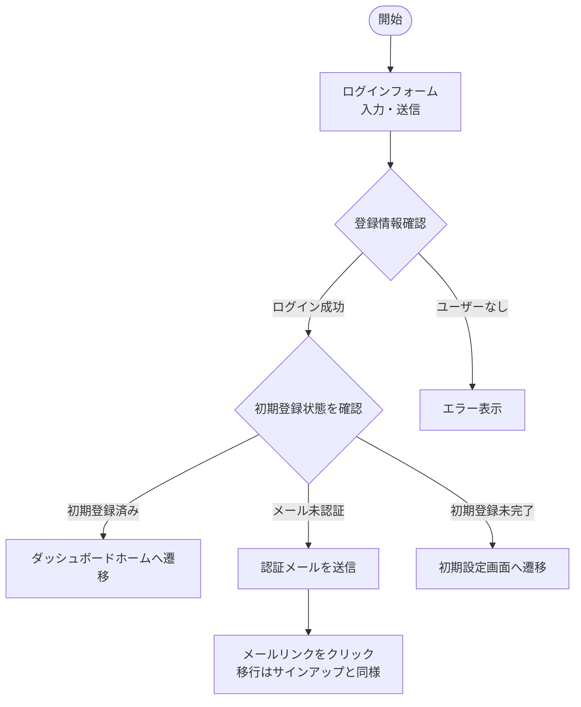
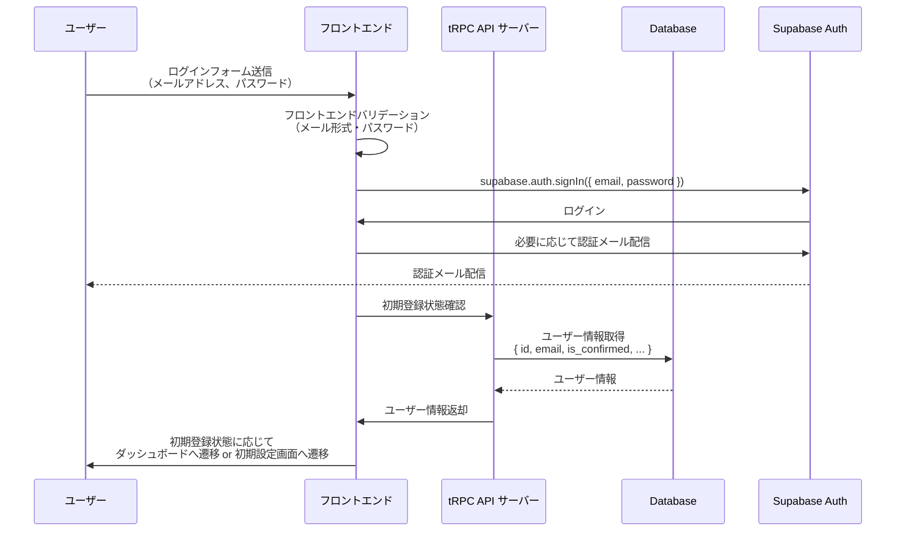

# ログイン機能設計

## 基本フロー

```mermaid
flowchart TD
    Start([開始]) --> A[ログインフォーム<br>入力・送信]
    A --> B{登録情報確認}
    B -- ログイン成功 --> C{初期登録状態を確認}
    B -- ユーザーなし --> D[エラー表示]
    C -- 初期登録済み --> E[ダッシュボードホームへ遷移]
    C -- メール未認証 --> F[認証メールを送信]
    F --> G[メールリンクをクリック<br>移行はサインアップと同様]
    C -- 初期登録未完了 --> H[初期設定画面へ遷移]
```

## ログインシーケンス

```mermaid
sequenceDiagram
    participant U as ユーザー
    participant FE as フロントエンド
    participant tRPC as tRPC API サーバー
    participant DB as Database
    participant SA as Supabase Auth

    %% 1. ユーザーがログインフォームを送信
    U->>FE: ログインフォーム送信<br/>（メールアドレス、パスワード）
    FE->>FE: フロントエンドバリデーション<br/>（メール形式・パスワード）

    %% 2. Supabase Auth にユーザー登録リクエスト
    FE->>SA: supabase.auth.signIn({ email, password })
    SA->>FE: ログイン
    FE->>SA: 必要に応じて認証メール配信
    SA-->>U: 認証メール配信
    FE->>tRPC: 初期登録状態確認
    tRPC->>DB: ユーザー情報取得<br/>{ id, email, is_confirmed, ... }
    DB-->>tRPC: ユーザー情報
    tRPC->>FE: ユーザー情報返却
    FE->>U: 初期登録状態に応じて<br/>ダッシュボードへ遷移 or 初期設定画面へ遷移
```
