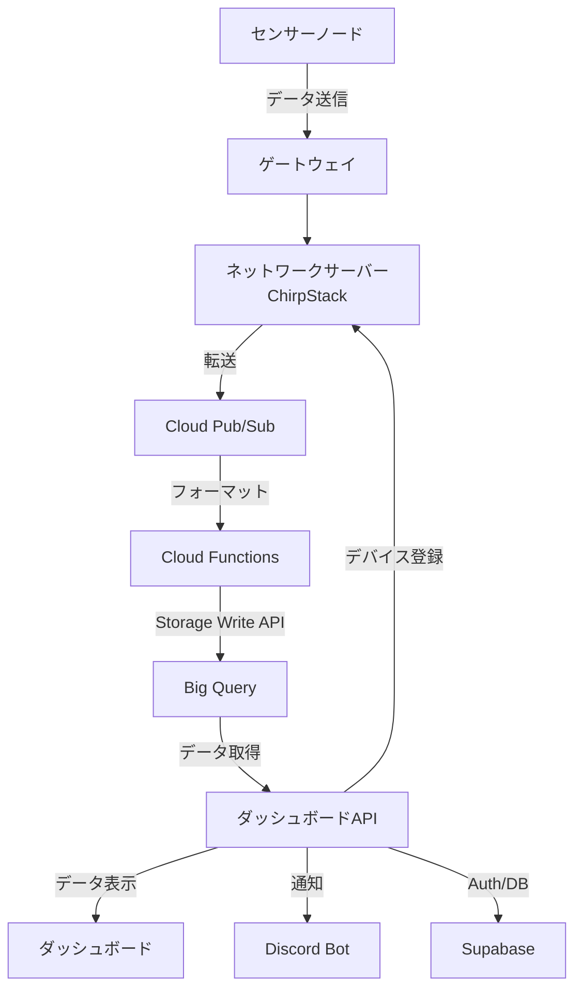
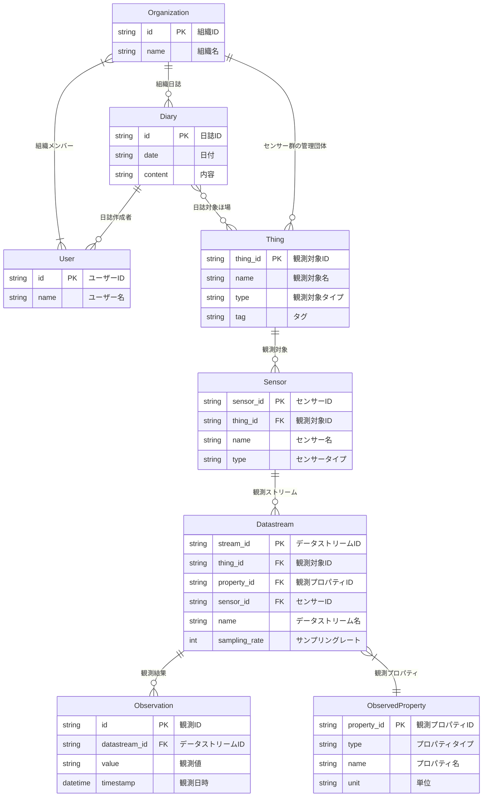

# IoTシステム基本設計

## 基本要件

このシステムは、小規模多品種栽培の農場向けのIoTシステムであり、農業の効率化・省力化と生産性向上を目指します。

### 農場監視指標

1. **土壌環境**:
   - 体積含水率
   - 土壌温度
   - 土壌EC (電気伝導度)
2. **気象環境**:
   - 気温
   - 湿度
   - 降水量
   - 風速
   - 日射量

### ダッシュボード機能

以下の機能を持つダッシュボードを提供します。

- **ホーム画面**:
  - リアルタイムデータの表示
  - 異常検知アラートの表示
  - 本日の天気予報
- **リアルタイムデータ表示**
- **履歴データ表示**
- **通知設定機能**
- **農作業日誌機能**
- **デバイス管理機能**

#### リアルタイムデータ表示

- **更新頻度**: 10分間隔でのリアルタイム更新
- **表示形式**:
  - 数値ゲージ（現在値）
  - 時系列グラフ（直近24時間）
- **表示データ**:
  - 土壌：体積含水率（%）、土壌温度（℃）、土壌EC（mS/cm）
  - 気象：気温（℃）、湿度（%）、降水量（mm）、風速（m/s）、日射量（W/m²）
- **アラート表示**: 閾値を超えた項目の色分け表示
- **データ品質表示**: 通信状態、センサー稼働状況の可視化

#### 履歴データ表示

- **期間選択機能**:
  - プリセット期間（過去24時間、1週間、1ヶ月、1年）
- **グラフ種別**:
  - 時系列ライングラフ
- **データ集約機能**:
  - 時間単位：生データ、時間平均、日平均

#### 通知設定機能

- **閾値設定**:
  - 上限・下限値の個別設定
- **通知条件**:
  - 30分以上の異常継続
- **通知チャンネル**:
  - Discord Bot（メンション付き）
- **通知内容**:
  - センサー位置、異常値、正常範囲、発生時刻

#### 農作業日誌機能

- **入力機能**:
  - 日付、作業内容、対象ほ場の選択
  - 写真添付機能（最大5枚）
  - タグ付け機能（作業種別、対象ほ場）
- **検索・フィルタリング**:
  - 日付範囲での検索
  - キーワード検索
  - 作業種別、対象ほ場、タグでのフィルタリング
- **センサーデータ連携**:
  - 日誌作成時にセンサーデータを自動取得
  - 日誌表示時に関連センサーデータを表示

#### デバイス管理機能

- **デバイス一覧表示**:
  - センサーID、設置場所、稼働状況
  - 最終通信時刻、バッテリー残量
  - データ取得状況（正常/異常/欠損）
- **デバイス詳細管理**:
  - センサー較正履歴の表示
  - 設定パラメータの変更（サンプリング間隔等）
  - タグ付け機能（設置場所、センサータイプ）
- **デバイス追加・削除**:
  - 新規センサーの登録ウィザード
  - デバイス削除

## システムアーキテクチャ

## データモデル

## ロードマップ

### 農業日誌・ユーザー管理機能

- **目標**: 農業日誌の基本機能とユーザー管理機能を実装
- **主要タスク**:
  - ユーザー登録・ログイン機能の実装
  - Organization作成機能の実装(招待なし)
  - 農業日誌の入力機能の実装(日付、内容、タグ)
  - 農業日誌のリスト表示・詳細表示画面の実装

### データ取得パイプライン実装

- **目標**: デバイス管理機能とセンサーデータの取得パイプラインを構築
- **主要タスク**:
  - デバイス管理機能の実装(センサー登録/編集/削除、一覧表示)
  - センサーデータ取得パイプラインの構築

### ダッシュボード表示実装

- **目標**: リアルタイムデータと履歴の実装
- **主要タスク**:
  - リアルタイムデータ表示機能の実装
  - 履歴データ表示機能の実装

### 通知機能・天気予報の実装

- **目標**: 通知機能の実装
- **主要タスク**:
  - 通知機能の実装(閾値設定、通知条件)
  - ダッシュボードのアラート表示
  - 天気予報の表示機能の実装

### 農業日誌・ダッシュボードの拡張

- **目標**: 農業日誌とダッシュボードの機能拡張
- **主要タスク**:
  - 農業日誌の写真添付機能の実装
  - 農業日誌のタグ付け機能の実装
  - 農業日誌の検索・フィルタリング機能の実装
  - ダッシュボードのデータ品質表示機能の実装
  - リアルタイムデータ表示や履歴データ表示のフィルタリング追加
