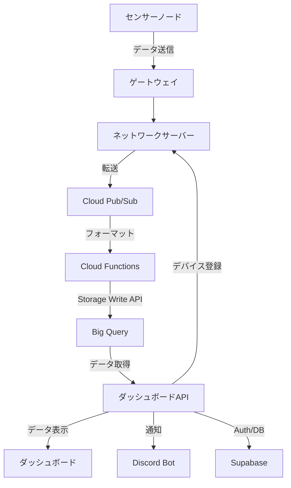
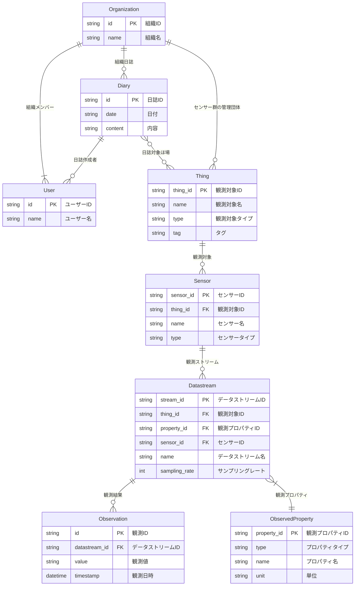

# IoTシステム基本設計

## 基本要件

このシステムは、小規模多品種栽培の農場向けのIoTシステムであり、農業の効率化と生産性向上を目指します。以下に、システムの要件を定義します。

### 農場監視指標

1. **土壌環境**:
   - 体積含水率
   - 土壌温度
   - 土壌EC (電気伝導度)
2. **気象環境**:
   - 気温
   - 湿度
   - 降水量
   - 風速
   - 日射量

### ダッシュボード機能

- **リアルタイムデータ表示**:
  - 土壌環境と気象環境のリアルタイムデータをグラフで表示
- **履歴データ表示**:
  - 過去のデータを選択して表示
  - 日別、週別、月別の履歴グラフ
  - キャリブレーション履歴
- **通知設定機能**:
  - 異常値の検知や欠損・通信断した際に通知
  - 通知方法: Discord
- **農作業日誌機能**:
  - 農作業の記録を入力
  - 日誌の検索・フィルタリング機能
- **デバイス管理機能**:
  - センサーやデバイスの状態を確認
  - デバイスの追加・削除・設定変更

## システムアーキテクチャ

## データモデル

