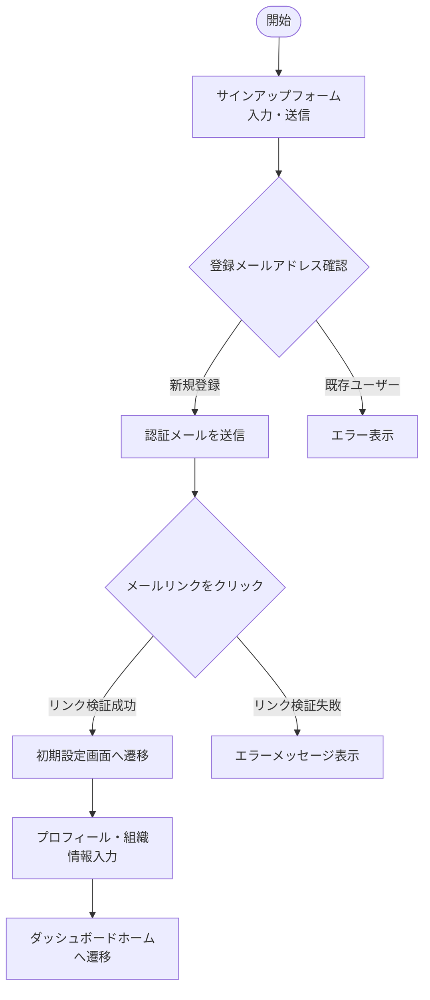
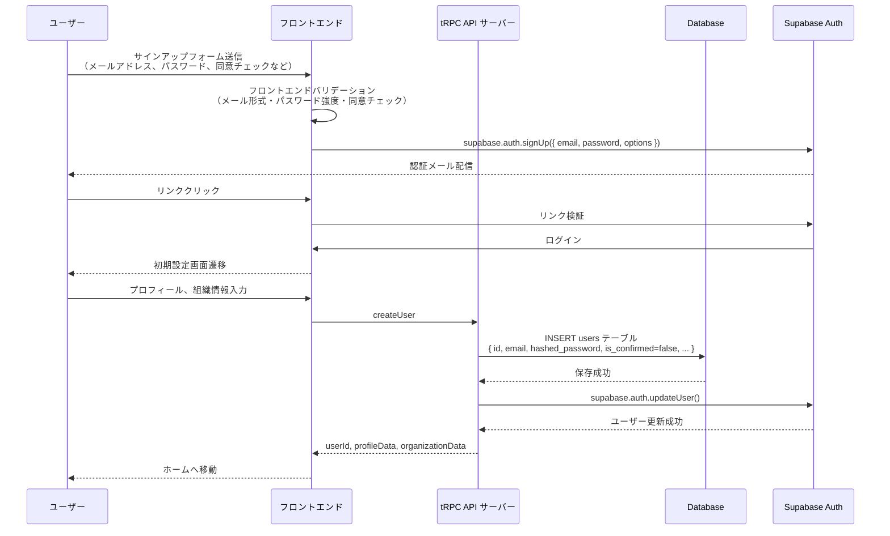

# サインアップ機能設計

## 基本フロー

```mermaid
flowchart TD
    Start([開始]) --> A[サインアップフォーム<br>入力・送信]
    A --> B{登録メールアドレス確認}
    B -- 新規登録 --> E[認証メールを送信]
    B -- 既存ユーザー --> D[エラー表示]
    E --> F{メールリンクをクリック}
    F -- リンク検証成功 --> G[初期設定画面へ遷移]
    F -- リンク検証失敗 --> H[エラーメッセージ表示]
    G --> I[プロフィール・組織<br>情報入力]
    I --> J[ダッシュボードホーム<br>へ遷移]
```

## サインアップシーケンス

```mermaid
sequenceDiagram
    participant U as ユーザー
    participant FE as フロントエンド
    participant tRPC as tRPC API サーバー
    participant DB as Database
    participant SA as Supabase Auth

    %% 1. ユーザーがサインアップフォームを送信
    U->>FE: サインアップフォーム送信<br/>（メールアドレス、パスワード、同意チェックなど）
    FE->>FE: フロントエンドバリデーション<br/>（メール形式・パスワード強度・同意チェック）

    %% 2. Supabase Auth にユーザー登録リクエスト
    FE->>SA: supabase.auth.signUp({ email, password, options })
    SA-->>U: 認証メール配信
    U->>FE: リンククリック
    FE->>SA: リンク検証
    SA->>FE: ログイン
    FE-->>U: 初期設定画面遷移

    %% 3. DB にユーザー情報保存
    U->>FE: プロフィール、組織情報入力
    FE->>tRPC: createUser
    tRPC->>DB: INSERT users テーブル<br/>{ id, email, hashed_password, is_confirmed=false, ... }
    DB-->>tRPC: 保存成功
    tRPC->>SA: supabase.auth.updateUser()
    SA-->>tRPC: ユーザー更新成功
    tRPC-->>FE:  userId, profileData, organizationData
    FE-->>U: ホームへ移動
```
